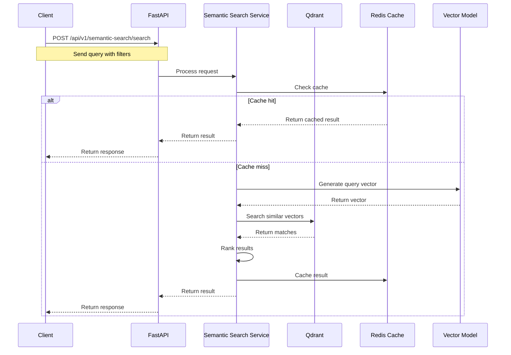
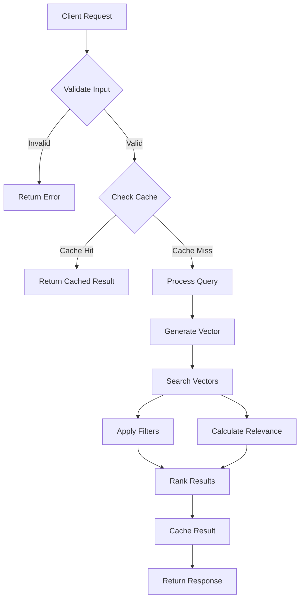
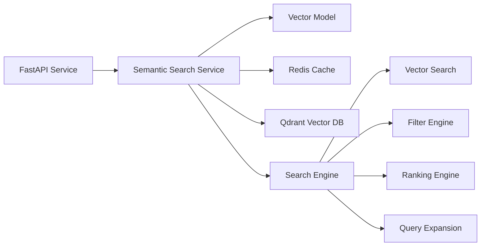

# Semantic Search Service Flow Diagrams

## Sequence Diagram

```mermaid
sequenceDiagram
    participant C as Client
    participant API as FastAPI
    participant SS as Semantic Search Service
    participant Q as Qdrant
    participant Redis as Redis Cache
    participant V as Vector Model

    C->>API: POST /api/v1/semantic-search/search
    Note over C,API: Send query with filters
    
    API->>SS: Process request
    SS->>Redis: Check cache
    
    alt Cache hit
        Redis-->>SS: Return cached result
        SS-->>API: Return result
        API-->>C: Return response
    else Cache miss
        SS->>V: Generate query vector
        V-->>SS: Return vector
        SS->>Q: Search similar vectors
        Q-->>SS: Return matches
        SS->>SS: Rank results
        SS->>Redis: Cache result
        SS-->>API: Return result
        API-->>C: Return response
    end
```

## Process Flow

```mermaid
graph TD
    A[Client Request] --> B{Validate Input}
    B -->|Invalid| C[Return Error]
    B -->|Valid| D{Check Cache}
    D -->|Cache Hit| E[Return Cached Result]
    D -->|Cache Miss| F[Process Query]
    F --> G[Generate Vector]
    G --> H[Search Vectors]
    H --> I[Apply Filters]
    H --> J[Calculate Relevance]
    I --> K[Rank Results]
    J --> K
    K --> L[Cache Result]
    L --> M[Return Response]
```

## Architecture Overview

```mermaid
graph LR
    A[FastAPI Service] --> B[Semantic Search Service]
    B --> C[Vector Model]
    B --> D[Redis Cache]
    B --> E[Qdrant Vector DB]
    B --> F[Search Engine]
    F --> G[Vector Search]
    F --> H[Filter Engine]
    F --> I[Ranking Engine]
    F --> J[Query Expansion]
``` 