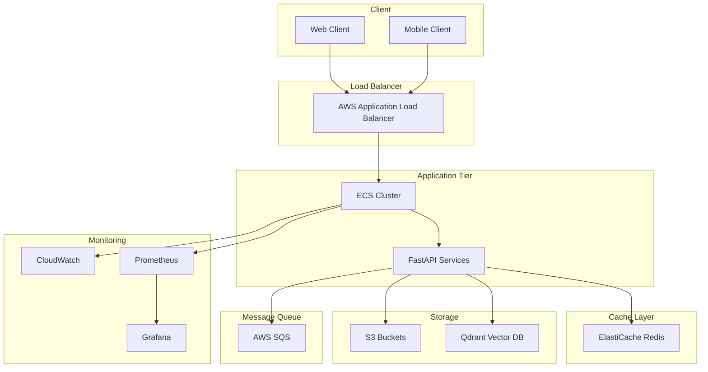

# Infrastructure Documentation

## Overview

This document details the infrastructure setup for the Air Applied AI Challenge project. The infrastructure is designed for high availability, scalability, and security using AWS services.

## Architecture Diagram



## AWS Services

### Compute (ECS)

#### Cluster Configuration
```hcl
resource "aws_ecs_cluster" "main" {
  name = "air-applied-ai-cluster"
  capacity_providers = ["FARGATE", "FARGATE_SPOT"]
}
```

#### Service Scaling
- Min capacity: 2
- Max capacity: 10
- Target CPU utilization: 70%
- Target Memory utilization: 80%

### Storage

#### S3 Buckets
1. Raw Data Bucket
   - Name: `air-applied-ai-raw-data`
   - Versioning: Enabled
   - Lifecycle Rules: 30-day transition to IA

2. Processed Data Bucket
   - Name: `air-applied-ai-processed`
   - Versioning: Enabled
   - Lifecycle Rules: 60-day transition to Glacier

### Database

#### Qdrant Vector Database
- Instance Type: r6g.2xlarge
- Storage: 1TB gp3
- Backup: Daily snapshots
- Retention: 30 days

### Caching

#### ElastiCache Redis
- Instance Type: cache.r6g.xlarge
- Multi-AZ: Enabled
- Automatic Failover: Enabled
- Backup: Daily
- Retention Period: 7 days

### Networking

#### VPC Configuration
- CIDR: 10.0.0.0/16
- Public Subnets: 10.0.1.0/24, 10.0.2.0/24
- Private Subnets: 10.0.3.0/24, 10.0.4.0/24
- NAT Gateways: 2 (one per AZ)

#### Security Groups
```hcl
resource "aws_security_group" "api" {
  name = "api-security-group"
  ingress {
    from_port = 443
    to_port = 443
    protocol = "tcp"
    cidr_blocks = ["0.0.0.0/0"]
  }
}
```

### Load Balancing

#### Application Load Balancer
- SSL/TLS termination
- HTTP/2 enabled
- WAF integration
- Custom error pages

### Monitoring & Logging

#### CloudWatch
- Metrics: 1-minute intervals
- Log retention: 30 days
- Alarms configured for:
  - CPU utilization
  - Memory utilization
  - API latency
  - Error rates

#### Prometheus & Grafana
- Custom dashboards for:
  - API metrics
  - Vector search performance
  - Cache hit rates
  - Resource utilization

## CI/CD Pipeline

### GitHub Actions Workflow
```yaml
name: Deploy Infrastructure

on:
  push:
    branches: [ main ]
    paths:
      - 'infrastructure/**'
      - '.github/workflows/deploy.yml'

jobs:
  terraform:
    runs-on: ubuntu-latest
    steps:
      - uses: actions/checkout@v2
      - name: Setup Terraform
        uses: hashicorp/setup-terraform@v1
      - name: Terraform Init
        run: terraform init
      - name: Terraform Plan
        run: terraform plan
      - name: Terraform Apply
        if: github.ref == 'refs/heads/main'
        run: terraform apply -auto-approve
```

## Infrastructure as Code

### Directory Structure
```
infrastructure/
├── modules/
│   ├── ecs/
│   ├── networking/
│   ├── storage/
│   └── monitoring/
├── environments/
│   ├── prod/
│   ├── staging/
│   └── dev/
└── variables/
```

### Terraform Configuration
```hcl
terraform {
  backend "s3" {
    bucket = "air-applied-ai-terraform-state"
    key    = "prod/terraform.tfstate"
    region = "us-east-2"
  }
}
```

## Scaling Strategy

### Horizontal Scaling
- ECS Service Auto Scaling
- ALB Target Group scaling
- Redis cluster scaling

### Vertical Scaling
- Container resource allocation
- Database instance sizing
- Cache instance sizing

## Security

### IAM Policies
- Principle of least privilege
- Service roles
- Resource-based policies

### Network Security
- VPC security groups
- Network ACLs
- WAF rules

### Data Security
- At-rest encryption
- In-transit encryption
- Key management (KMS)

## Disaster Recovery

### Backup Strategy
- S3 versioning
- Database snapshots
- Configuration backups

### Recovery Procedures
1. Infrastructure recreation
2. Data restoration
3. Service verification

## Cost Optimization

### Resource Optimization
- Spot instances usage
- Auto-scaling policies
- Storage lifecycle policies

### Cost Monitoring
- AWS Cost Explorer
- Budget alerts
- Resource tagging

## Maintenance

### Update Strategy
- Rolling updates
- Blue-green deployments
- Canary releases

### Monitoring
- Health checks
- Performance metrics
- Error tracking

## Troubleshooting

### Common Issues
1. Deployment failures
   - Check CloudWatch logs
   - Verify IAM permissions
2. Performance issues
   - Monitor resource utilization
   - Check scaling policies
3. Connectivity issues
   - Verify security groups
   - Check route tables 